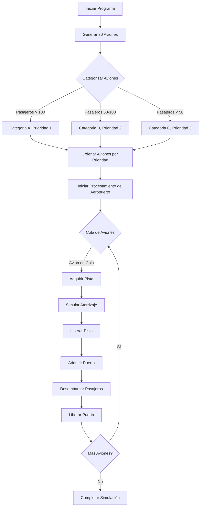

```mermaid
flowchart TD
    A[Iniciar Programa] --> B[Generar 30 Aviones]
    B --> C{Categorizar Aviones}
    C --> |Pasajeros > 100| D[Categoria A, Prioridad 1]
    C --> |Pasajeros 50-100| E[Categoria B, Prioridad 2]
    C --> |Pasajeros < 50| F[Categoria C, Prioridad 3]
    
    D --> G[Ordenar Aviones por Prioridad]
    E --> G
    F --> G
    
    G --> H[Iniciar Procesamiento de Aeropuerto]
    H --> I{Cola de Aviones}
    
    I --> |Avión en Cola| J[Adquirir Pista]
    J --> K[Simular Aterrizaje]
    K --> L[Liberar Pista]
    
    L --> M[Adquirir Puerta]
    M --> N[Desembarcar Pasajeros]
    N --> O[Liberar Puerta]
    
    O --> P{Más Aviones?}
    P --> |Sí| I
    P --> |No| Q[Completar Simulación]
```