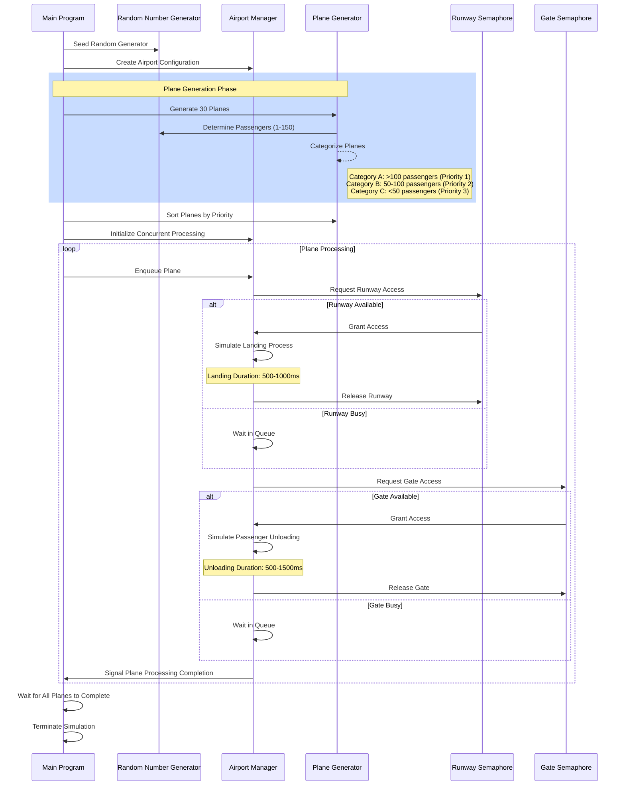

```mermaid
sequenceDiagram
    participant Main as Main Program
    participant RNG as Random Number Generator
    participant Airport as Airport Manager
    participant Plane as Plane Generator
    participant Runway as Runway Semaphore
    participant Gate as Gate Semaphore

    Main->>RNG: Seed Random Generator
    Main->>Airport: Create Airport Configuration
    rect rgb(200,220,255)
    Note over Main, Plane: Plane Generation Phase
    Main->>Plane: Generate 30 Planes
    Plane->>RNG: Determine Passengers (1-150)
    Plane-->>Plane: Categorize Planes
    Note right of Plane: Category A: >100 passengers (Priority 1)<br/>Category B: 50-100 passengers (Priority 2)<br/>Category C: <50 passengers (Priority 3)
    end
    
    Main->>Plane: Sort Planes by Priority
    Main->>Airport: Initialize Concurrent Processing
    
    loop Plane Processing
        Main->>Airport: Enqueue Plane
        Airport->>Runway: Request Runway Access
        alt Runway Available
            Runway->>Airport: Grant Access
            Airport->>Airport: Simulate Landing Process
            Note over Airport: Landing Duration: 500-1000ms
            Airport->>Runway: Release Runway
        else Runway Busy
            Airport->>Airport: Wait in Queue
        end
        
        Airport->>Gate: Request Gate Access
        alt Gate Available
            Gate->>Airport: Grant Access
            Airport->>Airport: Simulate Passenger Unloading
            Note over Airport: Unloading Duration: 500-1500ms
            Airport->>Gate: Release Gate
        else Gate Busy
            Airport->>Airport: Wait in Queue
        end
        
        Airport->>Main: Signal Plane Processing Completion
    end
    
    Main->>Main: Wait for All Planes to Complete
    Main->>Main: Terminate Simulation
```